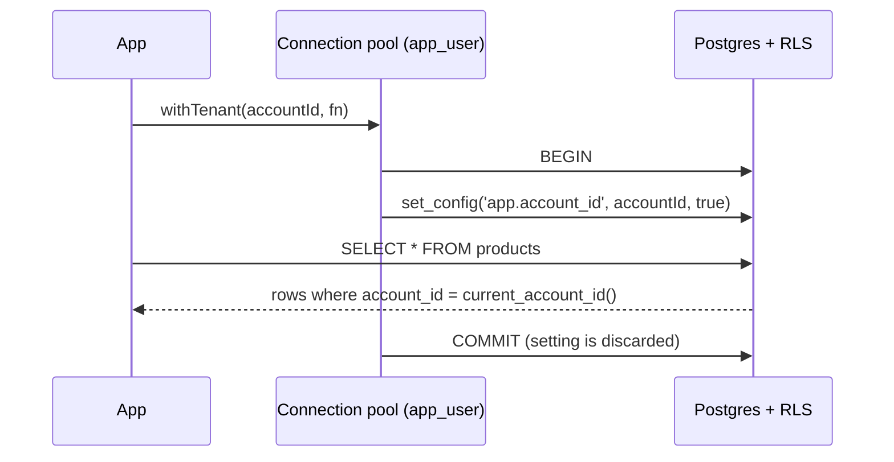

# multi-tenant-rls

[](https://github.com/TowerTKL/multi-tenant-rls/actions/workflows/ci.yml)

Tenant isolation in Postgres that doesn't depend on anyone remembering a `WHERE account_id = ?`.

This is the pattern I use for multi-tenant SaaS (it came out of building [PizzaFlow](https://github.com/TowerTKL/pizzaflow)), stripped down to the parts that matter: row-level security policies in the database, one `withTenant()` helper in the app, and a test suite that tries to break it.

```ts
const products = await withTenant(accountId, (tx) => tx.select().from(productsTable));
// only this tenant's rows, even though the query has no filter
```

## How it works



1. **The app connects as `app_user`**, a role that doesn't own the tables and has no `BYPASSRLS`. Policies are also `FORCE`d, so even the owner would be filtered if it ever served traffic.
2. **Every tenant table has one policy**: `account_id = current_account_id()`, for both `USING` (what you can see) and `WITH CHECK` (what you can write).
3. **`withTenant()` sets the tenant inside a transaction** with `set_config(..., true)`. Because it's transaction-local, it vanishes on commit or rollback, and a pooled connection can't carry tenant A into tenant B's request.
4. **Outside `withTenant()` there is no tenant**, so every table reads as empty. Forgetting the helper fails closed, not open.

A couple of details that took some care:

- `current_account_id()` wraps the setting in `nullif(..., '')`. After a custom setting has been used once on a connection, Postgres reads it back as an empty string instead of `NULL`, and `''::uuid` throws instead of just matching nothing.
- Child tables reference `stores (account_id, id)` with a composite foreign key. RLS alone would let tenant A insert an order with its own `account_id` but tenant B's `store_id`; the composite key makes that impossible.

## What the tests prove

`test/isolation.test.ts` runs against a real Postgres with the pool capped at one connection, so every query reuses the same physical connection:

| Scenario | Result |
| --- | --- |
| Tenant reads a table | only its own rows |
| Tenant asks for another tenant's row by id | empty |
| Query outside `withTenant()` | empty, on every table |
| Next query on the same connection after a tenant transaction | empty, nothing leaks |
| Two tenants in parallel | each sees only its own data |
| Update or delete another tenant's row | 0 rows affected |
| Insert a row stamped with another tenant's id | rejected by the policy (`42501`) |
| Point a row at another tenant's store | rejected by the foreign key (`23503`) |
| Malformed tenant id | rejected before it reaches the database |

## Run it

Requires Node 22, pnpm and Docker.

```bash
pnpm install
cp .env.example .env
docker compose up -d
pnpm db:migrate
pnpm test
```

To see it from the outside:

```bash
pnpm db:seed
pnpm demo
# Bella Massa    sees: Portuguesa, Quatro Queijos
# Forno & Lenha  sees: Margherita, Calabresa
# no tenant      sees: 0 rows
```

## Layout

```
migrations/0001_init.sql   tables, app_user role, current_account_id(), policies
src/db/schema.ts           Drizzle schema mirroring the migration
src/db/client.ts           runtime (app_user) and owner connections
src/db/tenant.ts           withTenant()
src/scripts/               migrate, seed, demo
test/isolation.test.ts     the suite above
```

## Notes

- The `app_user` password in the migration is for local development and CI. In production, create the role outside migrations and keep its credentials in your secret store.
- RLS is the safety net, not the only check. In a real app I still scope queries explicitly and check permissions in the server action; the database is there for the day one of those is missed.
- Migrations run as the owner on purpose. Seeding and admin tasks bypass RLS; request handling never does.

MIT licensed.
